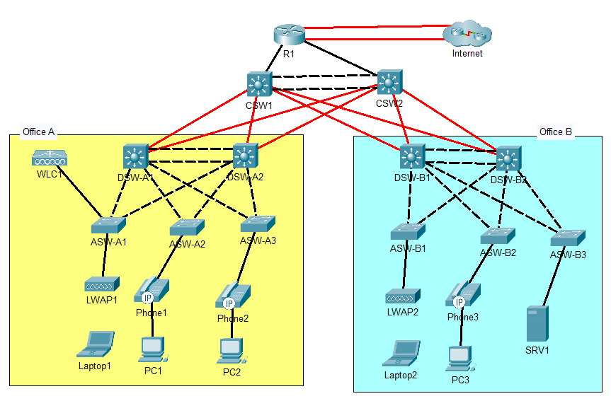

# CCNA Mega Lab – Jeremy’s IT Lab

This repository contains my personal implementation of the **CCNA Mega Lab** created by [Jeremy’s IT Lab](https://www.youtube.com/@JeremysITLab), a YouTube channel focused on Cisco’s CCNA certification.

## Network Topology

The following image shows the complete topology used in this lab:

## Objective

To reinforce understanding of key CCNA topics by applying them in a complete lab environment with multiple routers, switches, and PCs — simulating a realistic enterprise topology.

## Tools Used

- **Cisco Packet Tracer 8.2.2**
- Environment: Simulated
- `.pka` file included in the repository

## Repository Structure

ccna-mega-lab-jitla  
|-- configs # Device configuration backups  
|  |--R1.txt  
|  |--CSW1.txt  
|  |--CSW2.txt  
|  |--DSW-A1.txt  
|  |--DSW-A2.txt  
|  |--DSW-B1.txt  
|  |--DSW-B2.txt  
|  |--ASW-A1.txt  
|  |--ASW-A2.txt  
|  |--ASW-B1.txt  
|  |--ASW-B2.txt  
|-- docs  
|  |--connections-ipv4-addresses-xlsx  
|-- lab  
|  |-- ccna-mega-lab-jeremy's-it-lab.pka # Packet Tracer project file  
|  |-- topology.png # Network topology image  
|-- README.md # This file

## Topics Covered

- IPv4 Addressing and Subnetting
- VLANs and Inter-VLAN Routing
- Layer-2 and Layer-3 EtherChannel, HSRP
- Rapid Spanning Tree Protocol
- Static and Dynamic Routing (OSPF)
- Network Services: DHCP, DNS, NTP, SNMP, Syslog, FTP, SSH, NAT
- Security: ACLs and Layer-2 Security Features
- IPv6
- Wireless

## Notes

- All configurations were made manually, based on Jeremy’s video series, with a focus on CLI practice.
- The lab was tested in Packet Tracer, but the concepts apply to GNS3 or real Cisco hardware as well.

## Credits

- **Jeremy’s IT Lab**  
  A YouTube channel focused on CCNA: [@JeremysITLab](https://www.youtube.com/@JeremysITLab)

---

📌 _This project is for educational purposes only and has no official affiliation with Cisco Systems or the original content creator._
